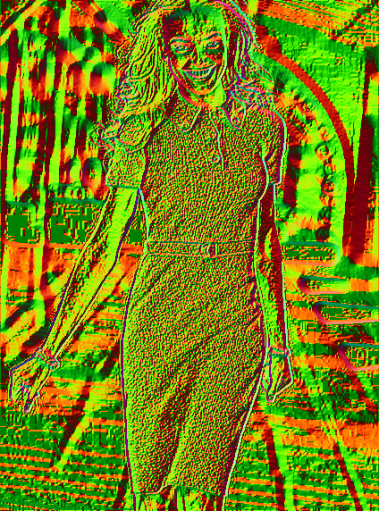
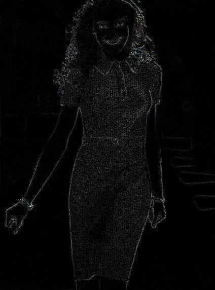
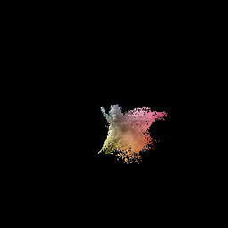

phoenix - Image Forensics
=======
phoenix is a small image forensics tool that can run some common analyses on images. It was inspired by the image analyses at the [Hackerfactor Blog](http://www.hackerfactor.com/blog/), and implements some of the algorithms used there. It is named phoenix because it has resurrected many times before taking its current form in C++.

Features:
* Error Level Analysis
* Luminance Gradient
* Average Distance
* HSV and Lab colorspace histograms
* JPEG resave quality estimate ([ImageMagick](http://www.imagemagick.org/script/index.php)-style and [Hackerfactor jpegquality](http://www.hackerfactor.com/src/jpegquality.c) estimates)
* Extract JPEG Quantization Tables
* Copy-Move (Clone Stamp) Detection

#Usage
* `-h | -help` display help text.
* `-f | -file <path>` Required, the path to the source image.
* `-o | -output [path=./]` Save results in files (as PNG)
* `-d | -display` Display results
* `-ela [quality=70]` Error Level Analysis
* `-lg` Luminance Gradient
* `-avgdist` Average Distance
* `-hsv [whitebg=0]` HSV Colorspace Histogram
* `-lab [whitebg=0]` Lab Colorspace Histogram
* `-labfast [whitebg=0]` Lab Colorspace Histogram, faster but less accurate version (256*256 instead of 1024*1024 output)
* `-copymove [retain=4] [qcoeff=1.0]` Copy-Move Detection
* `-a | -autolevels` Flag to enable histogram equalization (auto-levels) on output images

#Compiling
phoenix depends on OpenCV (2.4.9) and Boost (1.55.0) Libraries. Exact versions are probably not required. Try `make` to compile. The defaults should work if you didn't do anything fancy while compiling OpenCV or Boost, i.e. change default install path. You can use the shell scripts in `install_scripts` to compile Boost, OpenCV and then phoenix. The scripts are intended for provisioning Vagrant machines, but you can also use it to automatically compile phoenix. Don't clone the repository if you will use the scripts, it will do it for you.

#Outputs
Here are some examples of phoenix output with the image used in the legendary [Body By Victoria](http://www.hackerfactor.com/blog/?/archives/322-Body-By-Victoria.html) analysis by Neal Krawetz.

##ELA (Error Level Analysis)
```
./phoenix -f bbv.jpg -o -d -ela
```


##LG (Luminance Gradient)
```
./phoenix -f bbv.jpg -o -d -lg
```


##AVGDIST (Average-Distance of Neighbor Pixels)
```
./phoenix -f bbv.jpg -o -d -avgdist
```


##Copy-Move Detection
```
./phoenix -f bbv.jpg -o -d -copymove 4 5
```


##HSV Colorspace Histogram
```
./phoenix -f bbv.jpg -o -d -hsv
```


##Lab Colorspace Histogram
```
./phoenix -f bbv.jpg -o -d -labfast
```


#Resources
Some resources I used while developing many of the algorithms here.

* [Hackerfactor Blog](http://www.hackerfactor.com/blog/)
* [Quality Time with Your JPEGs](http://blog.apokalyptik.com/2009/09/16/quality-time-with-your-jpegs/)
* [Exploring JPEG](https://www.imperialviolet.org/binary/jpeg/)
* [ELA From Scratch](https://infohost.nmt.edu/~schlake/ela/)
* [elsamuko Image Forensics](https://sites.google.com/site/elsamuko/forensics)