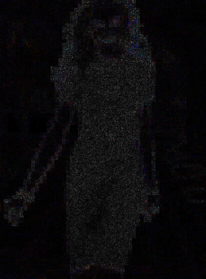
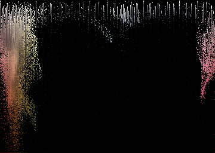

phoenix - Image Forensics
=======
phoenix is a small image forensics tool that can run some common analyses on images. It was inspired by the image analyses at the [Hackerfactor Blog](http://www.hackerfactor.com/blog/), and implements some of the algorithms used there. It is named phoenix because it has resurrected many times before taking its current form in C++.

Features:

* Error Level Analysis
* Luminance Gradient
* Average Distance
* HSV and Lab colorspace histograms
* JPEG resave quality estimate ([ImageMagick](http://www.imagemagick.org/script/index.php)-style and [Hackerfactor jpegquality](http://www.hackerfactor.com/src/jpegquality.c) estimates)
* Extract JPEG Quantization Tables

#Usage
* `-h | -help` display help text.
* `-f | -file <path>` Required, the path to the source image.
* `-o | -output [path]` Save results in files (as PNG), optionally to `path`.
* `-d | -display` Display results.
* `-ela` Error Level Analysis
* `-lg` Luminance Gradient
* `-avgdist` Average Distance
* `-hsv` HSV Colorspace Histogram
* `-lab` Lab Colorspace Histogram

#Screenshots
Here are some examples of phoenix output with the image used in the legendary [Body By Victoria](http://www.hackerfactor.com/blog/?/archives/322-Body-By-Victoria.html) analysis by Neal Krawetz.

##ELA (Error Level Analysis)

##LG (Luminance Gradient)

##AVGDIST (Average-Distance of Neighbor Pixels)

##HSV Colorspace Histogram

##Lab Colorspace Histogram

#Compiling
phoenix depends on OpenCV 2.4.6 and Boost 1.54.0 Libraries. Exact versions are probably not required. There is Windows (`Makefile-variables-win.mk`) and Linux (`Makefile-variables-linux.mk`) versions for the make variables to keep things a bit tidy. Change the first line of `Makefile` to match your system and edit the corresponding `Makefile-variables` file to match your local settings. The defaults should work if you didn't do anything fancy while compiling OpenCV or Boost.

#Resources
Some resources I used while developing many of the algorithms here.

* [Hackerfactor Blog](http://www.hackerfactor.com/blog/)
* [Quality Time with Your JPEGs](http://blog.apokalyptik.com/2009/09/16/quality-time-with-your-jpegs/)
* [Exploring JPEG](https://www.imperialviolet.org/binary/jpeg/)
* [ELA From Scratch](https://infohost.nmt.edu/~schlake/ela/)
* [elsamuko Image Forensics](https://sites.google.com/site/elsamuko/forensics)